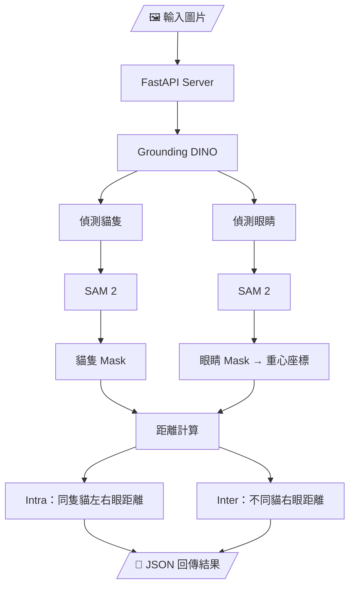
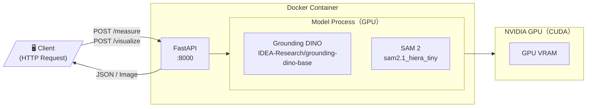

# Animal Eye Metrology（動物眼部測量系統）

## 1. 專案介紹

本專案探討如何將圖像分割（Image Segmentation）技術應用於實際的距離測量任務。

從 **COCO 2017 資料集（訓練集＋驗證集）** 中篩選出含有兩隻以上貓咪的圖片，共取得 **33 張**作為測試資料，並使用 **[CVAT](https://app.cvat.ai/)** 手動標註每隻貓的左眼與右眼關鍵點作為驗證基準（Ground Truth）。

系統以 **Grounding DINO** 進行零樣本物件偵測，先從整張圖找出每隻貓，再裁切局部區域偵測眼睛位置；接著以 **SAM 2** 對偵測結果生成像素級遮罩（Mask），從遮罩重心取得精確的眼部座標，計算以下兩種距離：

- 同一隻貓的雙眼距離（Intra-animal Distance）
- 任意兩隻貓各自右眼之間的距離（Inter-animal Distance）

整套 Pipeline 以 **FastAPI** 封裝為 REST API 服務，接受影像輸入，回傳每隻貓的分割遮罩、眼睛座標與測量結果，並可透過 `/visualize` 端點直接取得標注後的視覺化圖像。

---

## 2. 系統架構圖

### 2.1 AI Pipeline（資料流）



### 2.2 部署架構（服務層）



---

## 3. 技術棧說明

### AI 模型

| 模型 | 版本 / 來源 | 用途 |
|------|-------------|------|
| Grounding DINO | `IDEA-Research/grounding-dino-base`（HuggingFace） | 物件偵測 |
| SAM 2 | `sam2.1_hiera_tiny`（Meta Research） | 圖像分割 |
| PyTorch | `>= 2.1.0`（基底 image：`pytorch/pytorch:2.5.1-cuda12.4-cudnn9`） | 模型推論框架 |

---

### 後端服務

| 套件 | 用途 |
|------|------|
| FastAPI | REST API 框架，處理影像上傳與結果回傳 |
| Uvicorn | ASGI server，啟動 FastAPI |
| python-multipart | 支援 `multipart/form-data` 影像上傳 |

---

### 影像處理

| 套件 | 用途 |
|------|------|
| OpenCV (`opencv-python-headless`) | 影像讀取、CLAHE 增強、輪廓繪製、視覺化輸出 |
| Pillow | 影像裁切、對比度與銳利度調整 |
| NumPy | Mask 陣列運算、幾何重心計算、距離計算 |

---

### 部署

| 工具 | 用途 |
|------|------|
| Docker | 容器化，確保環境一致 |
| NVIDIA Container Runtime | 讓 Docker 容器存取 GPU（CUDA 12.4） |

---

### 資料與標註工具

| 工具 | 用途 |
|------|------|
| COCO 2017 Dataset | 訓練集＋驗證集，篩選含兩隻以上貓咪的圖片（共 33 張） |
| FiftyOne | 下載與篩選 COCO 資料集 |
| CVAT | 手動標註眼睛，建立 Ground Truth |

---

## 4. AI 模型說明與評估標準

### 4.1 模型選擇

#### Grounding DINO（物件偵測）

因本專案需要在 **48 小時**內完成實作，自行收集眼睛標註資料並訓練客製化模型的方案不在考量範圍內。YOLO、Mask R-CNN 等 mainstream 偵測模型的類別均基於 COCO 訓練集，COCO 本身並不包含「動物眼睛」作為獨立類別，使用這些模型偵測眼睛需重新收集資料訓練。Grounding DINO 以文字提示作為偵測目標，直接輸入 `"cat eye"` 即可，不需要任何額外訓練，是在時間與資料限制下最直接可行的方案。

版本選擇上，初期使用 `grounding-dino-tiny` 以配合 RTX 3050 Ti（4GB VRAM）的硬體限制，但實測發現 tiny 版本對非正面朝向的貓咪眼睛偵測效果不佳，誤偵測與漏偵測明顯，最終改用 `grounding-dino-base` 以提升準確率。

#### SAM 2（圖像分割）

以 Grounding DINO 輸出的 Bounding Box 作為 Prompt，生成像素級遮罩（Mask）。從 Mask 計算幾何重心作為眼球座標，比直接取 Bounding Box 中心點更能反映眼球的實際位置。

選用 `sam2.1_hiera_tiny`（SAM 2 最輕量版本），而非更新的 SAM 3，原因是 SAM 3 在 4GB VRAM 環境下極易觸發 OOM（Out of Memory）；tiny 版本在本機環境下可穩定運行。

---

### 4.2 參數設計與優化

系統共有兩組參數：貓隻偵測參數與眼睛偵測參數。

#### 貓隻偵測參數

| 參數 | 值 | 說明 |
|------|----|------|
| `CAT_THRESHOLD` | `0.15` | Grounding DINO 偵測貓隻的信心門檻。設定較低是因為貓咪可能被遮擋或角度不佳，過高會導致漏偵測。 |
| `CAT_NMS_IOU` | `0.4` | NMS（Non-Maximum Suppression）的 IoU 門檻。重疊超過 40% 的框視為重複偵測，只保留信心分數最高的。 |
| `CAT_CONTAIN_RATIO` | `0.7` | 若一個框有 70% 以上的面積被另一個框包含，則視為重複偵測並移除。用來過濾同一隻貓被框到多次的情況。 |

#### 眼睛偵測參數

| 參數 | 值 | 說明 |
|------|----|------|
| `EYE_THRESHOLD` | `0.10` | 眼睛偵測的信心門檻。眼睛目標小、特徵不明顯，需設定比貓隻更低的門檻才能偵測到。 |
| `EYE_NMS_IOU` | `0.3` | 眼睛偵測的 NMS 門檻。比貓隻更嚴格（0.3），因為兩眼距離近，需更積極去除重複框。 |
| `EYE_MAX_SIZE_RATIO` | `0.2` | 眼睛 Bounding Box 的最大尺寸限制，不得超過裁切區域的 20%。用來過濾誤偵測到臉部、耳朵等較大區域的情況。 |
| `PAIR_MIN_DIST_RATIO` | `0.05` | 兩眼之間的最小距離，不得小於裁切寬度的 5%。過濾掉同一顆眼睛被偵測兩次的情況。 |
| `PAIR_MAX_DIST_RATIO` | `0.35` | 兩眼之間的最大距離，不得超過裁切寬度的 35%。過濾掉跨越整張臉甚至跨貓的錯誤配對。 |
| `PAIR_MAX_AREA_RATIO` | `4.0` | 兩眼面積比例不得超過 4 倍。面積差異過大代表其中一個很可能不是眼睛。 |
| `EYE_UPSCALE_TARGET` | `512` | 裁切出的貓咪局部區域，若短邊小於 512px 則放大至此尺寸再送入 DINO 偵測。小圖放大後特徵更明顯，可提升眼睛偵測準確率。 |

#### 調參過程說明

以上參數經過多次測試與調整，為目前相對穩定的組合。

調參過程中嘗試過更複雜的眼睛驗證策略：同時偵測耳朵、頭部與鼻子，並以「眼睛必須在頭部範圍內」、「排除耳朵區域」、「眼睛必須位於圖像特定高度比例內」等幾何條件進行過濾。然而實際測試後發現，當多隻貓擠在一起時，頭部與耳朵的邊界難以區分，耳朵的辨識準確率甚至低於眼睛本身，反而引入更多誤判，大量時間消耗在調整幾何條件的參數上，效益有限。

最終採用較為精簡的過濾策略，以大小比例、距離比例與面積比例作為眼睛配對的判斷依據，並從資料面著手，移除貓咪朝向不一致、遮擋嚴重或距離過遠等難以偵測的樣本。

目前已知仍存在以下限制：
- **目標過小**：貓咪在畫面中佔比過小時，眼睛細節不足，偵測容易失敗
- **顏色干擾**：黑貓或黑白花色貓與背景或其他貓重疊時，輪廓與眼睛特徵難以區分
- **耳朵誤判**：部分圖片中耳朵仍會被誤識別為眼睛，導致雙眼配對錯誤

---

### 4.3 評估標準公式

系統以 `evaluate.py` 批次執行評估，將模型輸出與 Ground Truth 比對，計算以下指標：

#### 1. 分割準確度 — IoU（Intersection over Union）

用於評估 SAM 2 輸出的動物輪廓 Mask 與真實標註的重疊程度：

$$\text{IoU} = \frac{|A \cap B|}{|A \cup B|}$$

$A$ 為模型預測的 Mask 面積，$B$ 為真實標註的 Mask 面積。數值越接近 1 代表分割越精準。

- 平均 IoU：所有圖片的 IoU 平均值
- IoU > 0.5 比例：達到業界常用門檻的樣本佔比

#### 2. 眼睛定位 — MAE（Mean Absolute Error）

衡量模型預測的眼睛座標與 CVAT 手動標註座標之間的像素誤差：

$$\text{MAE} = \frac{1}{n}\sum_{i=1}^n |y_i - \hat{y}_i|$$

$y_i$ 為真實的像素座標，$\hat{y}_i$ 為模型預測值，$n$ 為樣本數。MAE 越小代表模型定位的像素偏差越少。

#### 3. 距離量測 — MAE 與 MAPE

分別對同隻貓雙眼距離（Intra）與跨貓右眼距離（Inter）計算：

**MAE**（絕對誤差，單位：px）：

$$\text{MAE} = \frac{1}{n}\sum_{i=1}^n |y_i - \hat{y}_i|$$

**MAPE**（相對誤差百分比）：

因為不同圖片的動物大小與拍攝距離不同，單純看像素誤差（MAE）不夠客觀。MAPE 將誤差比例化，更能反映相對準確度：

$$\text{MAPE} = \frac{100\%}{n}\sum_{i=1}^n \left| \frac{y_i - \hat{y}_i}{y_i} \right|$$

#### 4. 偵測準確度 — 混淆矩陣（Confusion Matrix）

除了數量統計外，系統進一步以混淆矩陣評估偵測的精準度與召回率。

**動物偵測**（以 IoU ≥ 0.5 作為配對門檻）：
- **TP**：GT 有這隻貓，且 Pred 偵測到的 Mask 與 GT 的 IoU ≥ 0.5
- **FP**：Pred 偵測到，但沒有對應的 GT（多抓）
- **FN**：GT 有這隻貓，但 Pred 沒有偵測到（漏抓）

**眼睛偵測**（以歐式距離 ≤ 10px 作為配對門檻）：
- **TP**：GT 標注的眼睛座標，有 Pred 眼睛座標在 10px 以內
- **FP**：Pred 偵測到的眼睛，沒有對應的 GT（多抓）
- **FN**：GT 標注的眼睛，沒有對應的 Pred（漏抓）

由此計算：

$$\text{Precision} = \frac{TP}{TP + FP}$$

$$\text{Recall} = \frac{TP}{TP + FN}$$

$$\text{F1} = \frac{2 \times \text{Precision} \times \text{Recall}}{\text{Precision} + \text{Recall}}$$

---

---

## 5. 量測方式與驗證

### 5.1 量測方式與公式

#### Step 1. 定位眼球中心點（Center of Mass）

首先透過 SAM 2 取得眼睛的二值化遮罩（Mask），計算所有有效像素點 $( x, y )$ 的平均座標作為眼球中心點：

$$(\bar{x}, \bar{y}) = \left( \frac{1}{N} \sum_{i=1}^{N} x_i,\ \frac{1}{N} \sum_{i=1}^{N} y_i \right)$$

$N$ 為 Mask 中值為 True 的總像素數量。

#### Step 2. 計算像素距離（Euclidean Distance）

取得兩點座標後，使用歐幾里得距離計算圖面上的直線像素距離：

$$d = \sqrt{(x_2 - x_1)^2 + (y_2 - y_1)^2}$$

- **Intra-animal Distance**：代入同一隻貓的左眼與右眼中心座標

右眼定義為座標中 x 值較小的眼睛（畫面中偏左側的眼睛），左眼則為 x 值較大的眼睛：

$$d_{\text{intra}} = \sqrt{(x_L - x_R)^2 + (y_L - y_R)^2}$$

$( x_R, y_R )$ 為右眼中心座標，$( x_L, y_L )$ 為左眼中心座標。

- **Inter-animal Distance**：代入任意兩隻貓各自的右眼中心座標

右眼定義為座標中 x 值較小的眼睛（畫面中偏左側的眼睛）：

$$d_{\text{inter}} = \sqrt{(x_{R2} - x_{R1})^2 + (y_{R2} - y_{R1})^2}$$

$( x_{R1}, y_{R1} )$ 為第一隻貓的右眼中心座標，$( x_{R2}, y_{R2} )$ 為第二隻貓的右眼中心座標。

> ⚠️ 僅當圖中所有貓都成功偵測到雙眼時，才會計算 Inter-animal Distance。任一隻貓眼睛偵測不足時此項跳過。
---

### 5.2 驗證方式

#### 資料集準備（Ground Truth）

測試資料集存於 `test_data/`，包含以下三份標註：

| 檔案 | 內容 |
|------|------|
| `ground_truth_segments.json` | 動物輪廓多邊形（來自 COCO 官方標註） |
| `ground_truth_eyes.json` | 每隻貓的左眼與右眼座標（CVAT 手動標註） |
| `ground_truth_distances.json` | 預先計算好的雙眼距離與跨動物右眼距離真實值(透過CVAT手動標註眼睛後，再透過公式計算) |

#### 自動化評估流程

`evaluate.py` 執行以下步驟：

1. 將測試圖片送至 FastAPI `/measure` 端點取得預測結果（Bounding Box、Mask RLE、量測距離）
2. **數量統計**：統計全圖 GT 與預測的動物總數、眼睛總數，用來評估模型是否有漏抓或誤判的情況
3. **動物匹配**：計算預測 Mask 與真實標註 Mask 的 IoU，將 IoU 最高且重疊達一定程度的視為同一隻動物
4. **眼睛匹配**：計算預測眼球中心與真實座標的歐幾里得距離，找出最近的對應點
5. 將所有結果套入 MAE / MAPE 公式統計誤差
6. 輸出 `evaluation_results.json`，包含：
   - GT 與預測的動物、眼睛總數對比
   - 平均 IoU（分割品質）
   - 眼睛中心定位 MAE（px）
   - Intra / Inter 距離量測的 MAE 與 MAPE

#### 邊界情況與跳過機制

核心設計原則：**只要眼睛抓不齊，就不硬算距離，直接跳過不計入誤差統計。**

**情境一：這隻貓少抓了一隻眼睛（偵測到眼睛數 < 2）**

如果一隻貓只抓到一顆眼睛，程式就沒辦法算這隻貓的雙眼距離。就算標註資料（Ground Truth）裡有這隻貓的正確距離，因為模型沒抓齊兩顆眼，程式會直接印出 `⚠️ 眼睛不足，跳過`，這筆資料不會計入最終的 MAE / MAPE，避免用不完整的點亂算。

**情境二：抓不到兩隻貓各自的右眼**

要量「貓 A 到貓 B 的右眼距離」，前提是這兩隻貓都必須分別被抓到右眼。只要其中一隻貓的眼睛偵測失敗（例如只有一顆眼，或完全沒抓到），導致程式拿不到兩個右眼座標，這張圖的跨動物距離就直接顯示 `Skip`，不列入統計。

---

## 6. 評估結果

本系統針對 **33 張** 測試圖片進行批次評估，結果如下（詳細數據見 `evaluation_results.json`）：

### 偵測精準度 (Detection Quality)

| 評估項目 | 動物偵測 (IoU ≥ 0.5) | 眼睛偵測 (dist ≤ 10px) |
|----------|----------------------|------------------------|
| **Precision** | 98.5% | 95.0% |
| **Recall** | 92.8% | 87.8% |
| **F1 Score** | 95.5% | 91.3% |

### 分割與定位誤差 (Localization Error)

| 指標 | 數值 | 說明 |
|------|------|------|
| **平均 IoU (動物)** | **0.816** | 分割效果極佳，主體提取穩定 |
| **平均 MAE (眼睛)** | **18.45 px** | 眼睛中心定位存在約 18 像素之微偏 |

### 距離量測誤差 (Metrology Error)

| 量測類型 | MAE (像素) | MAPE (百分比) |
|----------|------------|---------------|
| **雙眼距離 (Intra-animal)** | **3.83 px** | **7.88%** |
| **跨貓右眼距離 (Inter-animal)** | **13.43 px** | **9.7%** |

> **結果分析**：兩項主要的距離量測指標 MAPE 皆控制在 10% 以內（雙眼距離更是達到 7.88% 的高水準），這充分證明了本套基於 Grounding DINO + SAM 2 幾何重心的 Zero-shot Pipeline，在不靠額外訓練資料與微調的有限開發資源下，已能提供具高度參考準位與實用價值的微距測量成果。

---

---

## 7. 目錄結構與必要文件

本專案結構分為「API 服務」與「評估工具」兩大主體：

```text
Wiwynn_project/
├── animal-metrology/           # API 服務核心 (Docker 運行環境)
│   ├── checkpoints/            # 存放模型權重 (如 sam2.1_hiera_tiny.pt)
│   ├── outputs/                # 存放視覺化標注後的圖片
│   ├── src/
│   │   ├── main.py             # FastAPI 主程式：包含模型載入與推理邏輯
│   │   └── __init__.py         # Python 套件初始化
│   ├── .env.example            # 環境變數範例檔
│   ├── .gitignore              # 排除敏感或暫存檔案
│   ├── Dockerfile              # 建構 GPU 執行環境
│   ├── docker-compose.yml      # 定義容器運行的 Port 與 VRAM 掛載
│   └── requirements.txt        # 後端所需 Python 套件
│
├── test_data/                  # 測試資料夾 (與評估腳本連動)
│   ├── *.jpg                   # 測試影像檔案 (COCO 篩選出的圖片)
│   ├── ground_truth_segments.json   # 貓隻輪廓 GT (COCO)
│   ├── ground_truth_eyes.json       # 眼睛座標 GT (CVAT)
│   ├── ground_truth_distances.json  # 距離量測 GT (計算值)
│   └── ground_truth_boxes.csv       # 貓隻 BBox 資訊 (由 download_coco.py 產生)
│
├── evaluate.py                 # 自動化評估指令碼：批次測試 API 並統計誤差
├── download_coco.py            # 資料準備工具：下載 COCO 特定條件影像
├── create_distance.py          # 距離計算工具：根據 CVAT 眼睛座標產生數學距離 GT
└── README.md                   # 專案說明文件
```

---

## 8. 本地運行步驟

> ⚠️ 本專案建議使用 Docker 部署（見第 9 節）。
> 以下步驟適用於想直接在主機環境執行的使用者，
> 需要 NVIDIA GPU、CUDA 12.1+ 與 Python 3.10+。

### 步驟一：Clone 專案
```bash
git clone https://github.com/mkz0128/animal-eye-metrology.git
cd your-repo
```

### 步驟二：建立虛擬環境
```bash
# Windows
python -m venv venv
.\venv\Scripts\activate

# Linux / macOS
python -m venv venv
source venv/bin/activate
```

### 步驟三：安裝依賴套件
```bash
pip install -r animal-metrology/requirements.txt
pip install requests opencv-python numpy Pillow pycocotools
```

### 步驟四：下載 SAM 2 模型權重

SAM 2 的 checkpoint 需要手動下載並放到指定路徑：
```bash
# Windows (PowerShell)
mkdir animal-metrology\checkpoints
Invoke-WebRequest -Uri "https://dl.fbaipublicfiles.com/segment_anything_2/092824/sam2.1_hiera_tiny.pt" `
  -OutFile "animal-metrology\checkpoints\sam2.1_hiera_tiny.pt"

# Linux / macOS
mkdir -p animal-metrology/checkpoints
wget -O animal-metrology/checkpoints/sam2.1_hiera_tiny.pt \
  https://dl.fbaipublicfiles.com/segment_anything_2/092824/sam2.1_hiera_tiny.pt
```

> Grounding DINO 權重會在首次啟動時自動從 HuggingFace 下載，不需要手動處理。

### 步驟五：設定環境變數
```bash
cp animal-metrology/.env.example animal-metrology/.env
```

### 步驟六：準備測試資料

執行前請先確認 `download_coco.py` 內的 `TRAIN_ANN_FILE`、`VAL_ANN_FILE` 等路徑指向你本機的 COCO 資料夾，再執行：
```bash
python download_coco.py
```

這會自動篩選含有兩隻以上貓咪的圖片，下載至 `test_data/`。

### 步驟七：啟動 API 服務
```bash
cd animal-metrology
uvicorn src.main:app --host 0.0.0.0 --port 8000
```

服務啟動後可透過以下網址確認：
```
http://localhost:8000/health
```

### 步驟八：執行評估

開啟另一個終端機，回到專案根目錄執行：
```bash
python evaluate.py
```

結果輸出至 `evaluation_results.json`。

---

## 9. Docker 部署指令

### 環境需求

- Docker Desktop（Windows）或 Docker Engine（Linux）
- NVIDIA Container Toolkit（讓 Docker 存取 GPU）
- NVIDIA GPU，VRAM ≥ 4GB，CUDA 12.4+

### 步驟一：Clone 專案
```bash
git clone https://github.com/mkz0128/animal-eye-metrology.git
cd your-repo/animal-metrology
```

### 步驟二：設定環境變數
```bash
cp .env.example .env
```

根據需求調整 `.env`，預設值即可直接使用。

### 步驟三：建構並啟動服務
```bash
docker compose up --build
```

首次 build 會自動完成：
- 安裝所有 Python 套件
- 從 HuggingFace 下載 Grounding DINO 模型
- 從 Meta 官方下載 SAM 2 checkpoint（`sam2.1_hiera_tiny.pt`）

> ⚠️ 首次 build 時間較長（視網路速度約 5～15 分鐘），請耐心等待。

背景執行：
```bash
docker compose up --build -d
```

停止服務：
```bash
docker compose down
```

### 步驟四：確認服務正常
```bash
curl http://localhost:8000/health
```

預期回傳：
```json
{
  "status": "ok",
  "cuda": true,
  "gpu": "NVIDIA GeForce RTX XXXX"
}
```

---

## 10. API 文件

服務啟動後，FastAPI 會自動產生互動式 API 文件：

| 文件類型 | 網址 |
|----------|------|
| Swagger UI（互動式） | http://localhost:8000/docs |
| ReDoc（閱讀用） | http://localhost:8000/redoc |

### API 端點總覽

| 方法 | 端點 | 說明 |
|------|------|------|
| `POST` | `/measure` | 上傳圖片，回傳 JSON 測量結果 |
| `POST` | `/visualize` | 上傳圖片，回傳標注後的視覺化圖像 |
| `GET` | `/health` | 確認服務狀態與 GPU 資訊 |

### `/measure` 請求範例
```bash
curl -X POST http://localhost:8000/measure \
  -F "file=@your_image.jpg"
```

回傳結構：
```json
{
  "status": "success",
  "detected_animals": 2,
  "animals": [
    {
      "box": [x1, y1, x2, y2],
      "score": 0.85,
      "eyes_detected": 2,
      "eyes": [
        {"center": [x, y], "score": 0.72},
        {"center": [x, y], "score": 0.68}
      ],
      "has_segmentation": true,
      "mask_rle": {...}
    }
  ],
  "measurements": {
    "intra_animal_distances": [
      {"animal_index": 0, "distance_px": 35.6, "right_eye": [x, y], "left_eye": [x, y]}
    ],
    "inter_animal_distances": [
      {"animal_a": 0, "animal_b": 1, "distance_px": 123.4, "eye_a": [x, y], "eye_b": [x, y]}
    ],
    "inter_animal_right_eye_dist": 123.4
  }
}
```

### `/visualize` 請求範例
```bash
curl -X POST http://localhost:8000/visualize \
  -F "file=@your_image.jpg" \
  --output result.jpg
```

回傳標注後的 JPEG 圖片，包含：
- 每隻動物的分割遮罩與輪廓
- 眼睛位置標記（紅點）
- 雙眼連線與距離標注（黃線）
- 跨動物右眼連線（白線）

### 測試帳號

本服務為本地部署的 prototype，目前不需要身份驗證，所有端點皆可直接存取。

若未來需要對外公開部署，可考慮加入 API Key 或 OAuth2 認證機制（FastAPI 原生支援）。
